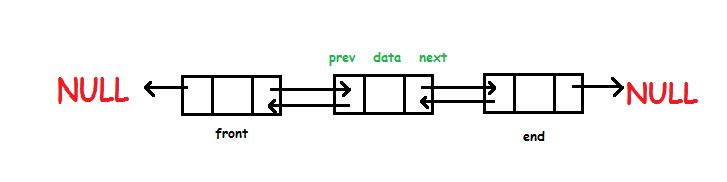

# DS-Algo-Python
Implementation of different data structures and algorithms using Python

- - -

### Array
*Python does not have built-in support for Arrays, but Python Lists can be used instead.*

- [array_.py](array_.py)

- - -

### Linked List
*A linked list is a sequence of data structures, which are connected together via links. Linked List is a sequence of links which contains items. Each link contains a connection to another link. Linked list is the second most-used data structure after array.*

- [linked_list.py](linked_list.py)

- - -

### Doubly Linked List
*Doubly linked list is a type of linked list in which each node apart from storing its data has two links. The first link points to the previous node in the list and the second link points to the next node in the list. The first node of the list has its previous link pointing to NULL similarly the last node of the list has its next node pointing to NULL.*

- [doubly_linked_list.py](doubly_linked_list.py)

- - -

### Circular Linked List
*Circular Linked List is a variation of Linked list in which the first element points to the last element and the last element points to the first element. Both Singly Linked List and Doubly Linked List can be made into a circular linked list.*

- [circular_linked_list.py](circular_linked_list.py)

- - -

### Stack
*A stack is an Abstract Data Type (ADT), commonly used in most programming languages. It is named stack as it behaves like a real-world stack, for example – a deck of cards or a pile of plates, etc. Likewise, Stack ADT allows all data operations at one end only. At any given time, we can only access the top element of a stack. This feature makes it LIFO data structure. LIFO stands for Last-in-first-out. Here, the element which is placed (inserted or added) last, is accessed first. In stack terminology, insertion operation is called PUSH operation and removal operation is called POP operation*

  

- [stack_.py.py](stack_.py.py)

